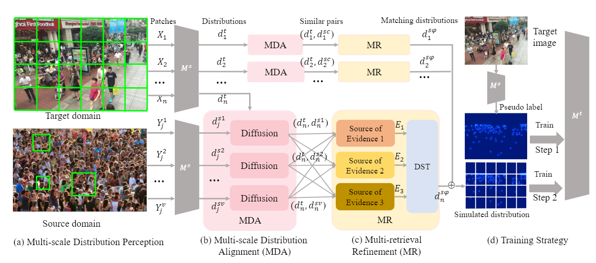

# FSIM
An official implement of 《Find Gold in Sand: Fine-Grained Similarity Mining for Domain-Adaptive Crowd Counting》
The code will be released after the paper is received.
# OverView
Our work proposes a domain-adaptive framework for crowd counting based on more sufficient and reliable inter-domain similarity. The framework not only effectively utilizes multi-scale domain alignment to explore inter-domain similarity fully but also filters these distributions using evidence theory based on various similarity measures. 

## Preparation
#### Requirements
- python >=3.6 
- pytorch >=1.4
- opencv-python >=4.0
- scipy >=1.4.0
- h5py >=2.10
- pillow >=7.0.0
- imageio >=1.18
- nni >=2.0 (python3 -m pip install --upgrade nni)
- Install Facebook FAISS by running conda install faiss-cpu -c pytorch 
Optional: install the faiss-gpu under the instruction according to your CUDA version
- Install joblib by running conda install joblib
- Install tqdm by running conda install tqdm
## Dataset
We support several datasets as
- ShanghaiTech 
- UCF-QNRF
- JHU-CROWD ++
- NWPU-CROWD 
## Obtain the distributions of the source domain and target domain
- cd /distribution/ 
- python handledata.py --datapath [datapath] --output [savepath] --model [model]
## Similarity retrieval.
- Target domain as query, source domain as gallery.
- python search.py --cache_dir [Directory to cache] --query_path [Target] --gallery_path [Source] --save_path [Save the results of similarity]
- python ds.py --target [Target] --source [Source] --path [the results of similarity] --output [outputpath to save traindata]
## Train and Test
Any crowd counting model can be chosen, and the model can be trained with similar data from the source domain as the target domain and tested in the target domain. This paper uses https://github.com/dk-liang/FIDTM.
